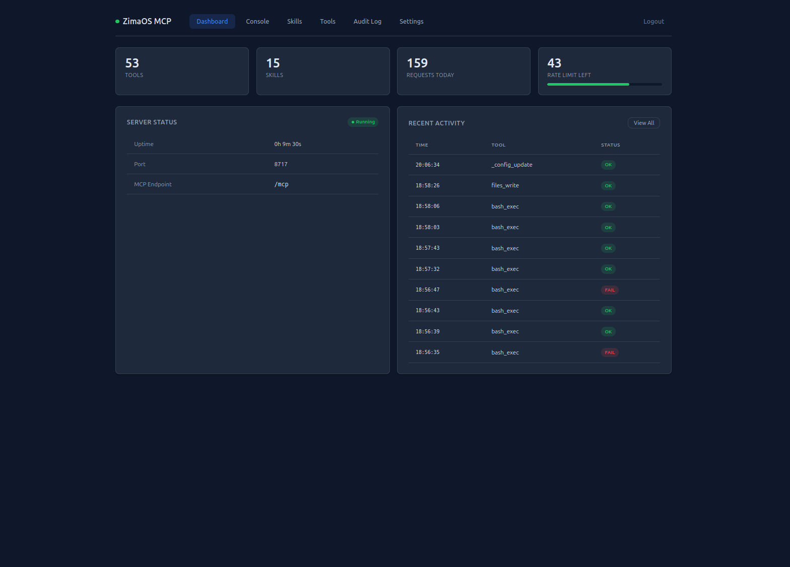
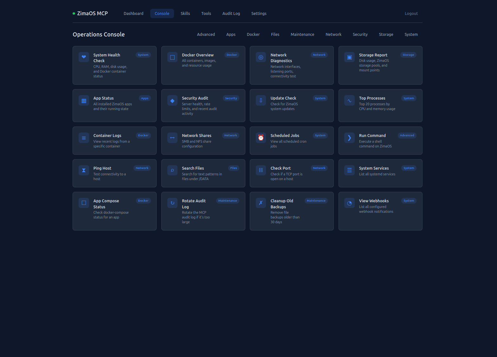
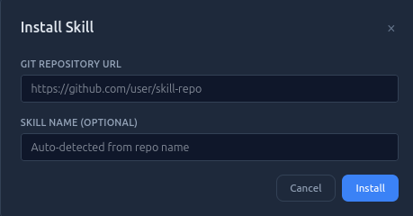

# ZimaOS MCP Server

Universal MCP (Model Context Protocol) Server for ZimaOS with web dashboard, operations console, skill marketplace, and comprehensive system management.

Enables AI assistants to manage your ZimaOS system via MCP protocol: execute commands, manage Docker containers, read/write files, monitor system health, schedule tasks, and install skills.



## Quick Start

```bash
# On your ZimaOS device
cd /DATA/AppData/zimaos-mcp
DOCKER_CONFIG=/DATA/.docker docker compose up -d --build
```

On first start, an **API key** is auto-generated and saved to `config.yaml`. Find it in the server logs:

```bash
DOCKER_CONFIG=/DATA/.docker docker logs zimaos-mcp | grep "API Key"
```

**Dashboard:** `http://<your-zimaos-ip>:8717/` (requires API key login)
**MCP Endpoint:** `http://<your-zimaos-ip>:8717/mcp`
**Health Check:** `http://<your-zimaos-ip>:8717/api/health`
**Readiness:** `http://<your-zimaos-ip>:8717/api/ready`
**Metrics:** `http://<your-zimaos-ip>:8717/api/metrics` (Prometheus format)

## MCP Client Configuration

Connect any MCP-compatible client to `http://<your-zimaos-ip>:8717/mcp` using streamable-http transport.

> **Note:** Direct Claude Desktop integration via `mcp-remote` is planned for a future version. Currently, the MCP endpoint is designed for programmatic access and the web dashboard.

## Tools (53)

| Category | Tools | Description |
|----------|-------|-------------|
| **Shell** | `bash_exec`, `bash_script` | Execute commands and scripts |
| **Files** | `files_read`, `files_write`, `files_list`, `files_delete`, `files_copy`, `files_move`, `files_info`, `files_search`, `files_chmod` | Filesystem operations with regex search |
| **Docker** | `docker_ps`, `docker_logs`, `docker_exec`, `docker_compose`, `docker_stats`, `docker_inspect`, `docker_images`, `docker_pull`, `docker_rmi` | Container and image management |
| **System** | `system_info`, `system_processes`, `system_services`, `system_network`, `system_disk`, `process_kill`, `system_service_control` | System monitoring and control |
| **Network** | `net_ping`, `net_dns`, `net_traceroute`, `net_port_check` | Network diagnostics |
| **ZimaOS** | `zima_apps_list`, `zima_app_install`, `zima_app_config`, `zima_storage_info`, `zima_shares` | ZimaOS-specific |
| **Cron** | `cron_list`, `cron_add`, `cron_delete`, `cron_toggle` | Job scheduling with enable/disable |
| **Updates** | `zima_update_check`, `zima_update_apply`, `zima_changelog` | System updates and release info |
| **Backup** | `backup_create`, `backup_list`, `backup_restore`, `backup_cleanup` | Data backup and restore |
| **Maintenance** | `audit_log_rotate`, `server_health` | Server maintenance and health checks |
| **Webhooks** | `webhook_list`, `webhook_add`, `webhook_delete`, `webhook_test` | Event notifications to external services |

## MCP Resources

The server exposes live system data as MCP Resources:

| URI | Description |
|-----|-------------|
| `zimaos://system/info` | CPU, RAM, disk, uptime |
| `zimaos://docker/containers` | All Docker containers and status |
| `zimaos://system/version` | ZimaOS and MCP server version |
| `zimaos://network/status` | Network interfaces and ports |
| `zimaos://storage/pools` | Storage pools and disk usage |

## MCP Prompts

Pre-built instruction templates for AI assistants:

| Prompt | Parameters | Description |
|--------|-----------|-------------|
| `troubleshoot_container` | `container_name` | Debug a Docker container |
| `system_health_report` | — | Comprehensive health check |
| `setup_backup` | `app_name` | Set up automated backups |
| `network_diagnosis` | `target_host` | Diagnose connectivity issues |
| `optimize_storage` | — | Analyze and optimize disk usage |

## Web Dashboard

The built-in dashboard at port 8717 provides:

- **Dashboard** — Server status, version, stats, resource meters, recent audit log (auto-refresh 10s)
- **Console** — Operations console with 20 pre-built templates for common tasks (one-click system health, Docker overview, network diagnostics, backup management, and more)
- **Skills** — Install and manage skills from the Anthropic Marketplace or Git repos, with hot-reload
- **Tools** — Browse all 53 tools and test them interactively, with response history and copy-to-clipboard
- **Audit Log** — Searchable, paginated history of all tool invocations (auto-refresh 15s)
- **Settings** — Configure rate limits, timeouts, allowed paths



### Operations Console Templates

| Category | Templates |
|----------|-----------|
| **System** | Health Check, Update Check, Top Processes, Services, Scheduled Jobs, Webhooks |
| **Docker** | Overview, Container Logs (with container selector), App Compose Status |
| **Network** | Diagnostics, Ping Host, Check Port, Network Shares |
| **Storage** | Storage Report |
| **Files** | Search Files |
| **Advanced** | Run Command |
| **Maintenance** | Rotate Audit Log, Cleanup Backups |

### Skill Marketplace

Install skills directly from [anthropics/skills](https://github.com/anthropics/skills). Three install methods: Marketplace (one-click), Git URL, or Drag & Drop upload. Skills can be enabled/disabled with hot-reload.



## Security

- **RBAC** — Three roles: `admin` (full access), `operator` (tools but no user/config management), `viewer` (read-only tools only). Users stored in `users.json` with masked keys.
- **API Authentication** — All `/api/*` endpoints require an API key (`Authorization: Bearer <key>` or `X-API-Key` header). Timing-safe HMAC comparison.
- **IP Whitelist** — Optional IP restriction via `ip_whitelist` config or `MCP_IP_WHITELIST` env var.
- **Path Validation** — Only `/DATA/`, `/tmp/`, `/var/log/` accessible; write-protected paths enforced.
- **Command Blocklist** — 37 regex patterns blocking destructive commands, nested shell bypass, data exfiltration, privilege escalation.
- **Input Validation** — Request size limits (default 1MB), argument injection prevention for network tools, interpreter allowlist for scripts.
- **Tiered Rate Limiting** — Per-operation-type limits (exec 1x, write 2x, read 5x base). HTTP 429 with `Retry-After` header.
- **Audit Logging** — Every tool invocation logged with user attribution, request-ID correlation, and sensitive data masking.
- **Failed Auth Logging** — Failed authentication attempts logged with IP and key prefix.
- **Webhook Alerts** — Automatic notifications on `tool.failed` events.
- **Skill Trust Tracking** — Untrusted skill sources flagged with warnings.

## Observability

- **Prometheus Metrics** — `/api/metrics` endpoint with request counts per tool, uptime, and tool count in OpenMetrics format.
- **Structured Logging** — JSON log format via `MCP_LOG_FORMAT=json`.
- **Request-ID Correlation** — UUID generated per request, included in audit logs and `X-Request-ID` response header.
- **Sensitive Data Masking** — Audit log args containing key/password/secret/token are automatically masked.
- **Health & Readiness** — `/api/health` (liveness) and `/api/ready` (Docker socket, data dir, tools registered).

## Configuration

```yaml
port: 8717
api_key: "your-key-here"      # auto-generated if empty
log_level: INFO
log_format: text               # "text" or "json"
rate_limit: 60
rate_window: 60
max_request_size: 1048576      # 1 MB
ip_whitelist: []               # empty = allow all
default_timeout: 60
max_timeout: 300
allowed_paths:
  - /DATA/
  - /tmp/
  - /var/log/
```

| Variable | Description |
|----------|-------------|
| `MCP_PORT` | Server port (default: 8717) |
| `MCP_API_KEY` | API authentication key |
| `MCP_LOG_LEVEL` | Log level: DEBUG, INFO, WARNING, ERROR |
| `MCP_LOG_FORMAT` | Log format: `text` or `json` |
| `MCP_RATE_LIMIT` | Max requests per window |
| `MCP_RATE_WINDOW` | Rate limit window in seconds |
| `MCP_IP_WHITELIST` | Comma-separated allowed IPs |
| `MCP_MAX_REQUEST_SIZE` | Max request body size in bytes |
| `MCP_DEFAULT_TIMEOUT` | Default command timeout |
| `MCP_MAX_TIMEOUT` | Maximum command timeout |
| `DOCKER_CONFIG` | Docker config path (default: /DATA/.docker) |

## Architecture

```
FastMCP Server (:8717)
├── /mcp           → MCP protocol (streamable-http)
│   ├── Tools (53)
│   ├── Resources (5)
│   └── Prompts (5)
├── /api/health    → Liveness check (no auth)
├── /api/ready     → Readiness check (no auth)
├── /api/metrics   → Prometheus metrics (no auth)
├── /api/auth      → Authentication check
├── /api/*         → REST API (dashboard backend, auth required)
└── /              → Static files (web dashboard + console)

Internals:
├── server.py      → Entry point, tool/resource/prompt registration
├── config.py      → Configuration with YAML + env overrides
├── security.py    → RBAC, auth, blocklist, rate limiting, audit, metrics
├── skills.py      → Skill lifecycle, marketplace, hot-reload
├── templates.py   → Operations console template definitions
├── api.py         → REST API with auth, RBAC, IP whitelist, rate limiting
└── tools/
    ├── utils.py        → Shared helpers (make_response, run_docker)
    ├── shell.py        → Command and script execution
    ├── files.py        → Filesystem ops, search, chmod
    ├── docker_tools.py → Container + image management
    ├── system.py       → System info, processes, services, process control
    ├── network.py      → Ping, DNS, traceroute, port check
    ├── zima.py         → ZimaOS apps, storage, shares
    ├── cron.py         → Cron scheduling with asyncio executor
    ├── updates.py      → Updates, changelog
    ├── maintenance.py  → Health, backups, log rotation
    └── webhooks.py     → Event notifications
```

## Development

```bash
# Run tests (81 tests)
python -m pytest tests/ -v

# Local development
pip install -r requirements.txt
python server.py
```

## Tech Stack

- **Backend:** Python 3.11, FastMCP, Starlette, uvicorn
- **Frontend:** Alpine.js, vanilla CSS (no build step)
- **Transport:** streamable-http
- **Deployment:** Docker with host network access
- **Monitoring:** Prometheus-compatible metrics

## Author

Holger Kuehn

## License

MIT
